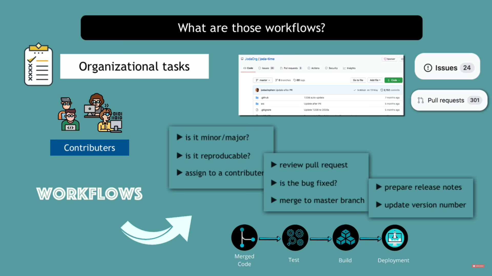
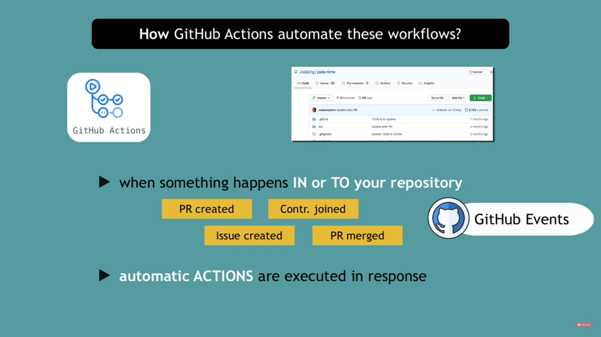
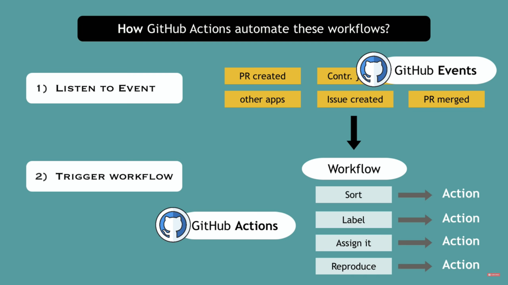
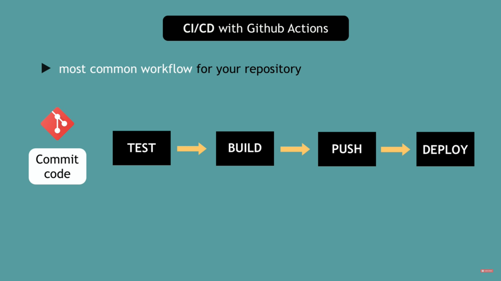
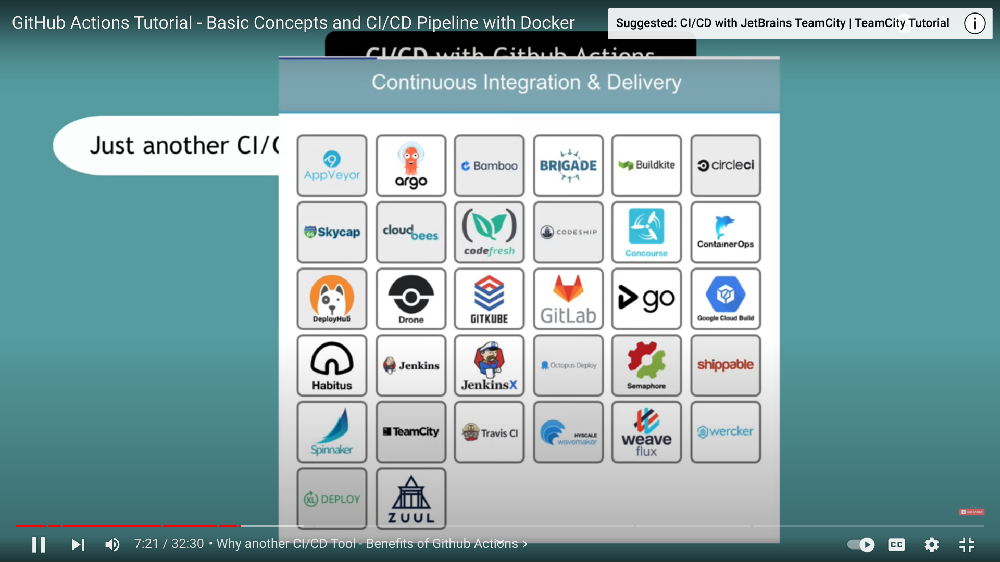
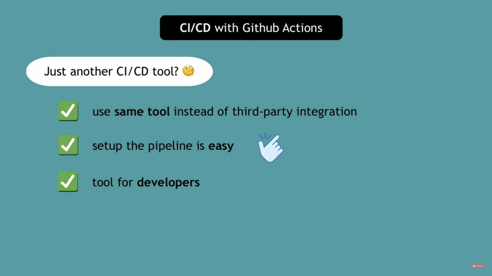
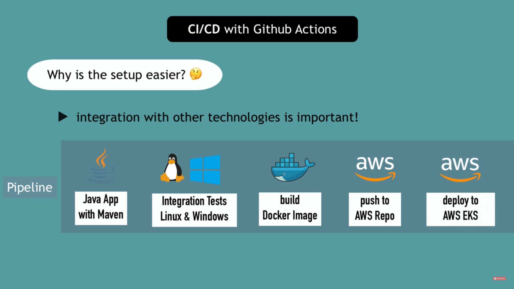
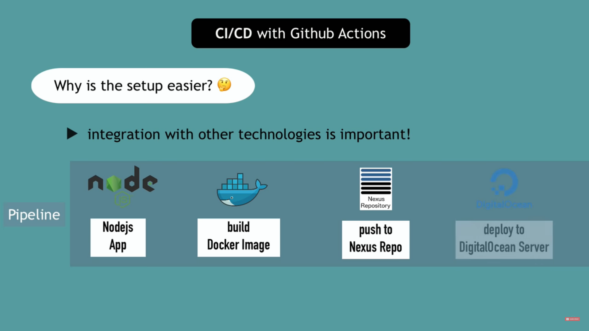
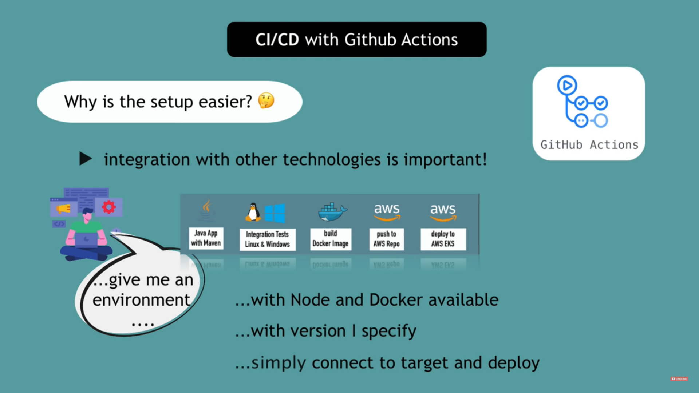

[What's Github Actions ?](#whats-github-actions)

[Developer Workflow **use cases**](#developer-workflow-use-cases)

[Basic Concepts: Github **Events & Actions**](#basic-concepts-github-events--actions)

[**CI/CD Pipeline** with Github Actions!](#cicd-pipeline-with-github-actions)

- [Benefits of Github Actions CI/CD](#benefits-of-github-actions-cicd)
- [DEMO](#demo)
- [Syntax](#syntax)

### What's Github Actions ?

- Platform to **automate developer workflows**

- ### What are the workflows ?

    

### Developer Workflow **use cases**

   

### Basic Concepts: Github **Events & Actions**

  

### **CI/CD Pipeline** with Github Actions!

  

  

  
  
  

  

  

CI/CD is a environment

  

- ### Benefits of Github Actions CI/CD
- ### DEMO
- ### syntax
