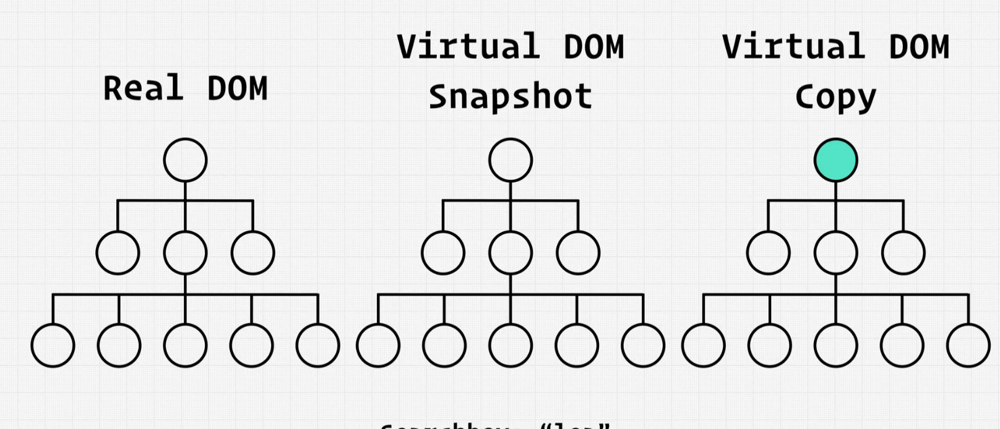
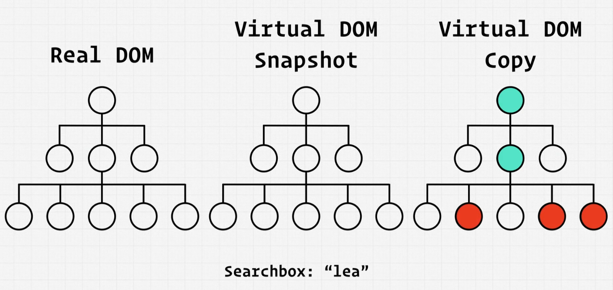
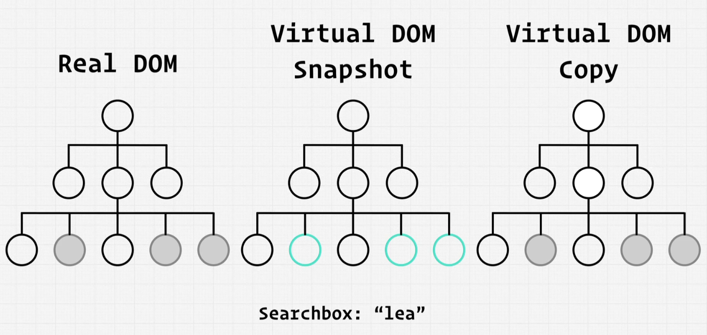

# DOM Tree

The `Document Object Model` (DOM) tree is a `hierarchical` representation of the structure of an HTML or XML document in a web browser.

It represents the `relationships` and `properties` of elements in the document. Here's a simplified representation of a DOM tree in Markdown raw output:

## HTML

```HTML
<!DOCTYPE html>
<html>
<head>
    <title>Title of the Page</title>
</head>
<body>
    <header>
        <h1>My Website</h1>
    </header>
    <nav>
        <ul>
            <li>Home</li>
            <li>About</li>
            <li>Contact</li>
        </ul>
    </nav>
    <main>
        <h2>Welcome to My Website</h2>
        <p>This is the main content of the page.</p>
        <a href="/about">Learn More</a>
    </main>
    <footer>
        <p>Copyright © 2023 My Website</p>
    </footer>
</body>
</html>

```

## DOM Tree Structure

- `Document` (root)
  - `html` element
    - `head` element
      - `title` element
        - Text: Title of the Page
    - `body` element
      - `header` element
        - `h1` element
          - Text: My Website
      - `nav` element
        - `ul` element
          - `li` elements
            - Text: Home
            - Text: About
            - Text: Contact
      - `main` element
        - `h2` element
          - Text: Welcome to My Website
        - `p` element
          - Text: This is the main content of the page.
        - `a` element
          - Text: Learn More
          - Attribute: href="/about"
      - `footer` element
        - `p` element
          - Text: Copyright © 2023 My Website

# Virtual DOM

- **Expensive DOM Manipulation:** Performing direct DOM manipulation in web applications can be computationally expensive and inefficient.

- **Virtual DOM in React:** React introduces the concept of a Virtual DOM, which serves as a lightweight representation of the actual DOM in JavaScript.

- **Efficient Updates:** The Virtual DOM allows for efficient updates because making changes to the Virtual DOM is faster and easier compared to manipulating the real DOM directly. This is due to the fact that JavaScript operations are typically faster than directly modifying the browser's DOM.

- **Reconciliation:** React's Virtual DOM performs a process called "reconciliation" to efficiently update the actual DOM. It calculates the difference between the Virtual DOM and the real DOM, only applying the necessary changes to update the user interface. This minimizes unnecessary DOM manipulation and boosts performance.

- **Declarative Approach:** React encourages a declarative programming approach, where you specify how the UI should look based on the application's state. When the state changes, React automatically updates the Virtual DOM and efficiently applies the necessary changes to the actual DOM.

- **Component-Based Architecture:** React organizes UI elements into reusable components, making it easier to manage and update complex user interfaces. Each component manages its own state, which simplifies the process of building and maintaining web applications.

- **Benefits of JavaScript:** Since the Virtual DOM is implemented in JavaScript, developers can leverage the full power and flexibility of JavaScript to create dynamic and interactive web applications.

- **Cross-Platform Compatibility:** React's Virtual DOM is not tied to any specific browser or platform, making it suitable for building cross-platform web applications.

- **Easier Debugging:** With the Virtual DOM, it's easier to debug and test your components since you can inspect and manipulate the virtual representation of the UI before it's applied to the actual DOM.

- **Performance Optimization:** React's Virtual DOM also opens the door to various performance optimization techniques, such as batching updates and minimizing unnecessary renders, further enhancing the efficiency of web applications.

- **Community and Ecosystem:** React has a thriving community and a rich ecosystem of libraries and tools that complement its Virtual DOM, making it a popular choice for front-end development.

- **Server-Side Rendering (SSR):** React's Virtual DOM can be used for server-side rendering (SSR), improving SEO and initial page load performance by rendering pages on the server and sending them pre-populated to the client.

- **Mobile Development:** React Native, a framework based on React, extends the concept of the Virtual DOM to mobile app development, allowing developers to build native mobile apps using familiar web development techniques.

# DOM Manipulation

1. Real DOM
2. Virtual DOM which is the `Real DOM snapshot`
3. Virtual DOM copy

`step 1:` Make necessary in virtual DOM copy (3)

`step 2:` Compare the virtual DOM copy with the Virtual DOM snapshot(3 to 2).
after when comparing the virtual DOM copy with the Virtual DOM snapshot DOM then it will be highlighted

`step 3:` After comparing we know the changes we happened now it will be updated in real DOM.





# Pure React

```HTML
<!DOCTYPE html>
<html>

<head>
    <title>Hello</title>
    <script src="https://unpkg.com/react@17/umd/react.development.js"></script> <!-- Importing React library -->
    <script src="https://unpkg.com/react-dom@17/umd/react-dom.development.js"></script> <!-- Importing ReactDOM library -->
</head>

<body>
    <div id="root"></div> <!-- Root div where our React app will be mounted -->
    <script>
        // App component that includes TitleComponent and InputForm
        const App = (props) => {
            // React.createElement is used to create a new React element. The first argument is the type of the element (here, 'div').
            // The second argument is an object containing properties ('props') that get passed to the component.
            // The rest of the arguments are children of this element.
            return React.createElement('div', {}, [
                React.createElement(TitleComponent),
                React.createElement(InputForm)
            ]);
        }

        // UserComponent displays the user's name with animation
        const UserComponent = (props) => {
            // Here, we're creating a 'p' element with a className of 'animated-name'. The text inside the 'p' tag is `User name is ${props.name}`.
            return React.createElement('p', { className: 'animated-name' }, `User name is ${props.name}`);
        }

        // TitleComponent displays the title
        const TitleComponent = () => {
            // Here, we're creating an 'h1' element with no properties, and the text inside the 'h1' tag is `Say Your Name`.
            return React.createElement('h1', null, `Say Your Name`);
        }

        // InputForm includes an input field and UserComponent
        const InputForm = () => {
            const [name, setName] = React.useState(''); // name state

            // handleChange updates the name state
            const handleChange = (event) => {
                setName(event.target.value);
            }

            // Form includes an input field and UserComponent
            // Here, we're creating a 'form' element with no properties, and its children are an 'input' element and a UserComponent.
            // The 'input' element has several properties, including type, value, onChange, and placeholder.
            return React.createElement('form', {}, [
                React.createElement('input', { type: 'text', value: name, onChange: handleChange, placeholder: 'Enter your name' }),
                React.createElement(UserComponent, { name: name })
            ]);
        }

        // Render the App component into the root div
        // ReactDOM.render is used to render a React element into a DOM node.
        // The first argument is the element you want to render, and the second argument is the DOM node you want to render the element into.
        ReactDOM.render(
            React.createElement(App),
            document.getElementById('root')
        );
    </script>
</body>

</html>
```

# React with JSX

## What is JSX?

- JSX stands for JavaScript XML. It is a syntax extension for JavaScript, produced by the React library.
- It is used to describe what the UI should look like. JSX produces React "elements".

### Example of a JSX syntax:

```JSX
const element = <h1>Hello, world!</h1>;
```

### What is the difference between a component created with React.createElement and a JSX component?

- React.createElement is a method provided by React to create new React elements.
- This is what is used under the hood when you write JSX expressions.

### Example of a component created with React.createElement:

```JSX
 const element = React.createElement(
 'h1',
 {className: 'greeting'},
 'Hello, world!'
 );

```

`
The above two code snippets are equivalent. JSX provides a more readable and concise syntax to create React elements.`

## What is the react element?

React elements are the smallest building blocks of a React app. They are plain objects that describe what you want to see on the screen. Unlike browser DOM elements, React elements are cheap to create.

### Example:

`const element = React.createElement('div', {className: 'welcome'}, 'Hello, world!');`

## How is the react element converted?

React DOM takes care of updating the DOM to match the React elements.
This process is known as reconciliation. During reconciliation, React will compare the new React elements with the previous ones and only make updates and changes in the DOM that are necessary to bring the DOM to the desired state.

## JSX and HTML are similar in syntax, but there are a few key differences:

1. Syntax: JSX uses a syntax that resembles HTML, but it is actually JavaScript. HTML, on the other hand, is a markup language used for creating web pages.

2. JavaScript Expressions: JSX allows you to include JavaScript expressions within curly braces {}. This allows you to dynamically generate content or perform calculations within JSX elements. HTML does not have this capability.

3. Component Creation: JSX is commonly used in React to create dynamic and reusable components. JSX elements can be used to define the structure and behavior of these components. HTML, on the other hand, is used to define the structure of a web page.

4. Attribute Names: JSX uses camel case for attribute names, while HTML uses lowercase. For example, in JSX you would use className instead of class, and htmlFor instead of for.

5. Self-Closing Tags: In JSX, self-closing tags must be explicitly written with a closing slash, like <br />. In HTML, self-closing tags can be written without a closing slash, like <br>.

It's important to note that JSX is not directly understood by browsers. It needs to be transpiled into regular JavaScript using tools like Babel before it can be executed in a browser environment.

# DOM paint flash in dev tools

The term "DOM flash paint" isn't something you enable or disable directly in web development or browser settings. Instead, it refers to a visual issue or a situation where there's an unexpected delay or flickering in the rendering of a web page, typically caused by inefficient code or design.

To address or investigate a DOM painting issue or flickering in your web application, you should do the following:

Use Developer Tools: Open your browser's developer tools, as mentioned in the previous response (Ctrl + Shift + I or Cmd + Option + I in most browsers). These tools allow you to inspect and debug your web page's rendering and performance.

Record Performance: In the developer tools, you can use the "Performance" or "Timeline" tab to record and analyze the performance of your web page. This will help you identify any problematic areas causing the flickering.

Inspect Elements: Use the "Elements" or "Inspector" tab to inspect the HTML and CSS of the page. Look for elements that may be frequently changing or being repainted.

Console Logging: If you suspect JavaScript is causing the issue, check the browser console for error messages or excessive DOM manipulation.

Optimize Code and Styles: Once you've identified the root causes of the flickering (e.g., inefficient JavaScript code, animations, or complex layouts), you should optimize your code and styles to minimize or eliminate the issue.

Test Different Scenarios: Test your web page in various scenarios, browsers, and devices to ensure that the flickering problem is resolved or at least minimized across different user environments.

Monitor Changes: Keep an eye on your web page's performance and user feedback over time. Make adjustments as needed based on real-world usage.
