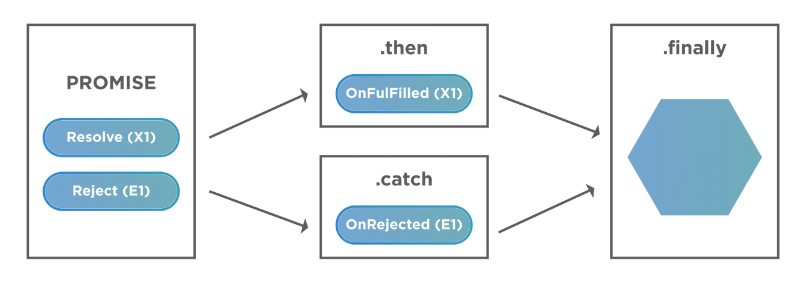

## Promise in JavaScript (with All the Methods)

[Promise.resolve()](#promiseresolve)

[Promise.reject()](#promisereject)

[Promise.then()](#promisethen)

[Promise.catch()](#promisecatch)

[Promise.finally()](#promisefinally)

[Custom promise wrapper](#custom-span-classimppromisespan-wrapper)



### Promise.resolve():

- The Promise.resolve() method returns a resolved Promise object with a given value. Depending upon a resolved promise value, it

1. returns promise if fulfilled with promise
2. returns a value if fulfilled with the value
3. returns thenable promise by adopting its eventual state if fulfilled with thenable promise

This function flattens nested layers of promise-like objects (e.g. a promise that resolves to a promise that resolves to something) into a single layer.

```javascript
Promise.resolve("Success")
  .then((value) => {
    console.log(value); // "Success"
  })
  .catch((error) => {
    console.log(error);
  });
```

### Promise.reject():

- Promise.reject() method returns a Promise object that is rejected with a given reason.

```javascript
Promise.reject("failure")
  .then((value) => {
    console.log(value);
  })
  .catch((error) => {
    console.log(error); // "failure"
  });
```

### Promise.then():

- The then() method returns a Promise. It takes up to two arguments: callback functions for the success and failure cases of the Promise.

```javascript
const promise1 = new Promise((resolve, reject) => {
  resolve("Success!");
});
promise1.then(
  (value) => {
    console.log(value);
    // expected output: "Success!"
  },
  (error) => {
    console.log(error);
  }
);
```

### Promise.catch():

- The catch() method returns a rejected Promise. It behaves the same as calling Promise.prototype.then(undefined, onRejected). Calling Promise.catch(onRejected) internally calls Promise.then(undefined, onRejected).

```js
const promise1 = new Promise((resolve, reject) => {
  throw "Exception handling";
});
promise1
  .then((value) => {
    console.log(value);
  })
  .catch((error) => {
    console.error(error);
  });

// "Exception handling"
```

### Promise.finally():

- The finally() method returns a Promise. When the promise is settled, the specified callback function is executed. This provides a way for code to be run irrespective of promise settlement. A finally callback will not receive any argument, since there is no way of determining if the promise was fulfilled or rejected.

```js
const promise1 = Promise.reject("Rejecting Promise");
promise1
  .then((value) => {
    console.log(value);
  })
  .catch((err) => {
    console.log(err);
  })
  .finally(() => {
    console.log("completed promise");
  });
// > "Rejecting Promise"
// > "completed promise"
```

### Promise warper

- A promise is a JavaScript object that contains the results of an asynchronous function. In other words, it represents a task that has been completed or failed in an asynchronous function.

```js
const promise = new Promise((resolve, reject) => {
  // code to execute
});
```

- The `promise constructor` takes one argument, a callback function also called the executor.
- The executor function takes in two callback functions: `resolve and reject.`
- If the executor function executes successfully, the resolve() method is called and the `promise state changes from pending to `.
- If the executor function fails, then the `reject()` method is called, and the `promise state changes from pending to `.

### Custom <span class='imp'>promise</span> wrapper

- One of the reasons that async/await is such an awesome feature in modern JavaScript is that it helps us avoid callback hell.

- Still, handling errors from multiple
  <span class='imp'>async</span> functions can lead to something like this:

```js
try {
  const a = await asyncFuncOne();
} catch (errA) {
  // handle error
}

try {
  const b = await asyncFunctionTwo();
} catch (errB) {
  // handle error
}

try {
  const c = await asyncFunctionThree();
} catch (errC) {
  // handle error
}
```

- If we add all the async functions in one try block, we’ll end up writing multiple if conditions in our catch block, since our catch block is now more generic:

```js
try {
  const a = await asyncFuncOne();
  const b = await asyncFunctionTwo();
  const c = await asyncFunctionThree();
} catch (err) {
  if (err.message.includes("A")) {
    // handle error for asyncFuncOne
  }
  if (err.message.includes("B")) {
    // handle error for asyncFunctionTwo
  }
  if (err.message.includes("C")) {
    // handle error for asyncFunctionThree
  }
}
```

- This makes the code less readable and difficult to maintain, even with the async/await syntax.

- To solve this problem, we can write a utility function that wraps the promise and avoids repetitive <span class='imp'> try...catch</span> blocks.

- The utility function will accept a promise as the parameter, handle the error internally, and return an array with two elements: resolved value and rejected value.

- The function will resolve the promise and return the data in the first element of the array. The error will be returned in the second element of the array. If the promise was resolved, the second element will be returned as null.

```js
const promiser = async (promise) => {
  try {
    const data = await promise;
    return [data, null]
  } catch (err){
    return [null, error]
  }
```

We can further refactor the above code and remove the <span class='imp'>try...catch </span>block by simply returning the <span class='imp'>promise</span> using the <span class='imp'>.then()</span> and <span class='imp'>.catch()</span> handler methods:

```js
const promiser = (promise) => {
  return promise.then((data) => [data, null]).catch((error) => [null, error]);
};
```
