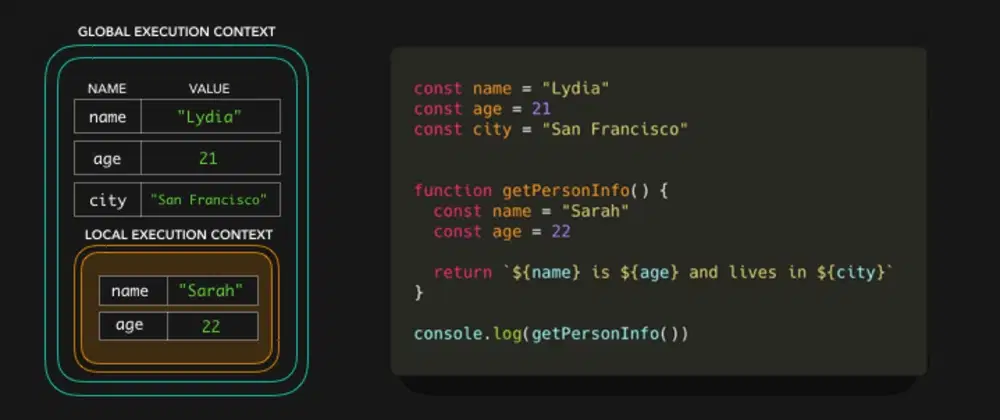

## ⚡️⛓JavaScript Visualized: Scope (Chain)

```JS
const name = "Lydia"
const age = 21
const city = "San Francisco"


function getPersonInfo() {
  const name = "Sarah"
  const age = 22

  return `${name} is ${age} and lives in ${city}`
}

console.log(getPersonInfo())

```

We're invoking the `getPersonInfo` function, which returns a string containing the values
of the `name`, `age` and `city` variables:

`Sarah is 22 and lives in San Francisco`. But, the `getPersonInfo` function doesn't contain a variable named `city` 🤨? How did it know the value of city?

First, memory space is set up for the different contexts. We have the `default global context `(`window` in a browser, `global` in Node), and a `local context` for the `getPersonInfo` function which has been invoked. Each context also has a `scope chain.`

For the `getPersonInfo` function, the scope chain looks something like this (don't worry, it doesn't have to make sense just yet):


The scope chain is basically a "chain of references" to objects that contain references to values (and other scopes) that are referencable in that execution context. (⛓: "Hey, these are all the values you can reference from within this context".) The scope chain gets created when the execution context is created, meaning it's created at runtime!

However, I won't talk about the activation object or the execution contexts in general in this post, let's just focus on scope! In the following examples, the key/value pairs in the execution contexts represent the references that the scope chain has to the variables.


The scope chain of the global execution context has a reference to 3 variables: `name` with the value `Lydia`, `age` with the value `21`, and `city` with the value `San Francisco`. In the local context, we have a reference to 2 variables: `name` with the value `Sarah`, and `age` with the value `22`.

When we try to access the variables in the `getPersonInfo` function, the engine first checks the local scope chain.


We can go down the scope chain, but we can't go up the scope chain. (Okay this may be confusing because some people say up instead of down, so I'll just rephrase: You can go to outer scopes, but not to more inner... (innerer..?) scopes. I like to visualize this as a sort of waterfall:


[reference](https://dev.to/lydiahallie/javascript-visualized-scope-chain-13pd)
