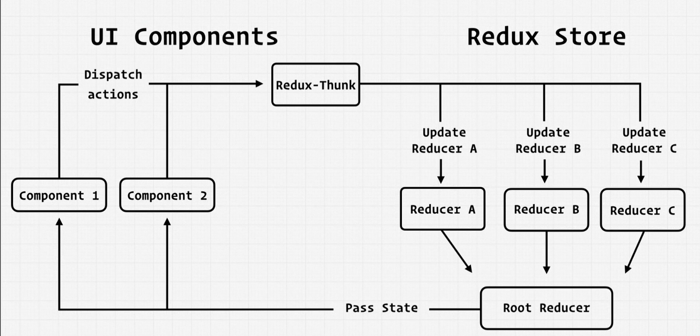

# redux persist

- The `persistConfig` object is used in Redux applications with Redux-Persist to configure how the Redux store's state should be persisted across sessions. It defines parameters such as the storage engine to use and which reducers to exclude from persistence.

Configuration object for Redux-Persist to define how the Redux store should be persisted.

### PersistConfig

- **key**: The key under which the persisted state will be stored in storage.

- **storage**: The storage engine to use for persisting state (e.g., localStorage, AsyncStorage).

- **blockList**: An array of reducer names to exclude from state persistence.

**Example:**

```javascript
// Configuration for Redux-Persist
const persistConfig = {
  key: "root", // Store state under the key "root"
  storage: storage, // Use the specified storage engine (e.g., localStorage)
  blockList: ["user"], // Exclude the "user" reducer from state persistence
};
```

- `key`: A unique key used to identify and store the persisted state. It allows you to have multiple persisted states in the same storage.
- `storage`: The storage engine that should be used for persisting state. This can be an instance of a storage engine (e.g., `localStorage`, `AsyncStorage`), which determines where and how the state is stored.

- `blockList`: An array of reducer names that should be excluded from state persistence. Reducers listed here will not be persisted and will start with their initial state on each app load.

# Redux Thunk



- **Redux Thunk** is middleware for the Redux library.
- It allows you to write **asynchronous logic** in Redux action creators.
- With Redux Thunk, action creators can return **functions** that take `dispatch` as an argument.
- These functions can perform **asynchronous operations**, like making API requests.
- You can **dispatch multiple actions** within a single action creator.
- Redux Thunk is commonly used for managing asynchronous data fetching and handling loading/success/error states in Redux applications.

```JSX
// Redux Thunk action creator
const fetchData = () => {
  return async (dispatch) => {
    // Dispatch an action to indicate that data fetching has started
    dispatch({ type: 'FETCH_DATA_REQUEST' });

    try {
      // Simulate an API request (replace with your actual API call)
      const response = await fetch('https://api.example.com/data');
      const data = await response.json();

      // Dispatch a success action with the fetched data
      dispatch({ type: 'FETCH_DATA_SUCCESS', payload: data });
    } catch (error) {
      // Dispatch an error action if the request fails
      dispatch({ type: 'FETCH_DATA_FAILURE', error });
    }
  };
};

// Redux reducer to handle the state changes
const initialState = {
  data: [],
  loading: false,
  error: null,
};

const dataReducer = (state = initialState, action) => {
  switch (action.type) {
    case 'FETCH_DATA_REQUEST':
      return { ...state, loading: true };
    case 'FETCH_DATA_SUCCESS':
      return { ...state, data: action.payload, loading: false };
    case 'FETCH_DATA_FAILURE':
      return { ...state, error: action.error, loading: false };
    default:
      return state;
  }
};

// Store configuration
import { createStore, applyMiddleware } from 'redux';
import thunk from 'redux-thunk';
const store = createStore(dataReducer, applyMiddleware(thunk));

// Dispatch the fetchData action
store.dispatch(fetchData());

// Access the Redux store state
const state = store.getState();
console.log(state);

```

We define a Redux Thunk action creator called fetchData. It returns a function that takes dispatch as an argument.

Inside the function, we dispatch actions to indicate the start of data fetching, successful data retrieval, or an error.

We create a Redux store with the applyMiddleware function from Redux, applying the thunk middleware.

We dispatch the fetchData action, which triggers the asynchronous data fetching.

Finally, we access the Redux store state to check the result of the data fetch operation.

Please note that this example uses simulated API requests with fetch for demonstration purposes. In a real application, you would replace the API call with your actual API endpoint and handling.

# Redux Saga

Redux Saga is a middleware library for managing side effects in Redux applications. It helps you handle asynchronous operations such as data fetching, network requests, and more in a structured and predictable way. Redux Saga is often used with React and Redux to manage complex asynchronous behavior.

## Key Features

- **Generators:** Redux Saga relies heavily on JavaScript generators (`function*`) to make asynchronous code look more synchronous and easier to read.

- **Declarative Effects:** Instead of writing complex callbacks or using Promises, you can describe your side effects as simple objects, making them easier to test and reason about.

- **Cancellable:** Redux Saga allows you to cancel and clean up asynchronous tasks when they are no longer needed, preventing memory leaks and unexpected behavior.

- **Error Handling:** It provides mechanisms for handling errors that occur during asynchronous operations.

## How Redux Saga Works

1. **Middleware Integration:** You include Redux Saga as middleware when configuring your Redux store.

2. **Saga Functions:** You create saga functions using generators. These functions watch for specific actions and define the behavior to execute when those actions are dispatched.

3. **Side Effects:** Inside sagas, you can perform various side effects, such as making API calls, dispatching other actions, or navigating to different routes.

4. **Effects Helpers:** Redux Saga provides a set of built-in functions (like `call`, `put`, `take`, etc.) to manage these side effects declaratively.

5. **Execution:** When actions matching the defined patterns are dispatched, Redux Saga will execute the corresponding sagas, running them in the background.

6. **Cancellation:** You can cancel sagas when needed, ensuring that ongoing tasks are terminated gracefully.

## Example

Here's a basic example of a Redux Saga that watches for a "FETCH_DATA" action and makes an API call:

```javascript
import { call, put, takeEvery } from "redux-saga/effects";
import { fetchDataSuccess, fetchDataFailure } from "./actions";
import api from "./api";

function* fetchDataSaga(action) {
  try {
    const data = yield call(api.fetchData, action.payload);
    yield put(fetchDataSuccess(data));
  } catch (error) {
    yield put(fetchDataFailure(error));
  }
}

function* rootSaga() {
  yield takeEvery("FETCH_DATA", fetchDataSaga);
}

export default rootSaga;
```

in this example, fetchDataSaga listens for "FETCH_DATA" actions, makes an API call using call, and dispatches success or failure actions.

Redux Saga is a powerful tool for managing complex asynchronous logic in Redux applications, offering better control, testability, and readability for your codebase.

## redux saga vs redux Thunk

### Redux Saga

- Uses generator functions (`function*`) to manage asynchronous actions.
- Provides a more structured and declarative way to handle side effects.
- Allows for more complex control flow, such as pausing and cancelling tasks.
- Well-suited for handling complex asynchronous operations and managing concurrency.
- Supports advanced features like race conditions and polling.

### Redux Thunk

- Uses regular JavaScript functions to handle asynchronous actions.
- Simpler to set up and get started with for basic asynchronous operations.
- Well-suited for simpler use cases and applications with less complex asynchronous behavior.
- Offers less control over advanced features like task cancellation and handling complex control flow.
- Easier learning curve for developers new to Redux.

# JavaScript Generators

JavaScript generators are a special type of function that allow you to control the flow of execution in a more flexible way. They are defined using the `function*` syntax and use the `yield` keyword to produce a sequence of values.

## Key Points

- Generators are defined using the `function*` syntax.
- They can pause their execution using the `yield` keyword and then resume from where they left off.
- When a generator function is called, it doesn't execute immediately. Instead, it returns an iterator object.
- You can advance the execution of a generator using the `.next()` method on the iterator.
- The `.next()` method returns an object with two properties:
  - `value`: The value yielded by the generator.
  - `done`: A boolean indicating whether the generator has completed.
- Generators are often used to simplify asynchronous code, making it look more like synchronous code.
- They are particularly useful when dealing with complex control flows, iterators, and asynchronous operations.

## Example

Here's a simple example of a generator function and how to use it:

```javascript
function* simpleGenerator() {
  yield 1;
  yield 2;
  yield 3;
}

// Creating an instance of the generator
const generator = simpleGenerator();

console.log(generator.next()); // { value: 1, done: false }
console.log(generator.next()); // { value: 2, done: false }
console.log(generator.next()); // { value: 3, done: false }
console.log(generator.next()); // { value: undefined, done: true }
console.log(generator.next()); // { value: undefined, done: true }
console.log(generator.next()); // { value: undefined, done: true }
```

## Reasons to Use Generators in JavaScript

Generators in JavaScript provide several valuable features and benefits:

- **Simplified Asynchronous Code:** Generators enable the creation of asynchronous code that resembles synchronous code, making it more readable and maintainable.

- **Pause and Resume Execution:** Generators can pause their execution using `yield`, allowing for the easy suspension and resumption of tasks.

- **Efficient Iteration:** Generators are useful for efficient iteration, especially when dealing with large datasets or infinite sequences.

- **Complex Control Flow:** They provide a flexible tool for managing complex control flow, such as handling race conditions or implementing finite state machines.

- **Cooperative Multitasking:** Generators support cooperative multitasking, enabling tasks to take turns executing without threads or true parallelism.

- **Cleaner Error Handling:** Error handling can be centralized within the generator, simplifying exception management.

- **Generator Functions as Observables:** Generator functions can be used to create observables and work with data streams.

- **Testing and Debugging:** Generators facilitate unit testing of asynchronous code by allowing controlled, step-by-step execution.

- **Improved Code Readability:** They enhance code readability and maintainability, reducing callback hell and promise chaining.

Generators are a powerful feature in JavaScript that addresses complex asynchronous and control flow challenges while improving code quality and developer experience.

# Redux tool kit

- **Redux Toolkit**

  - Redux Toolkit simplifies Redux state management in applications.
  - It reduces boilerplate code for actions and reducers.
  - Example functions: `createSlice`, `configureStore`, and `createAsyncThunk`.
  - Improves developer efficiency.
  - Encourages best practices in Redux development.

- **Redux Built-in Middleware**

  - Redux provides built-in middleware for store enhancement.
  - Examples: `redux-thunk` (async actions), `redux-logger` (state logging), `redux-promise` (promise handling).
  - Middleware extends and customizes Redux's behavior.

- **Serializable or Non-Serializable Values**

  - Redux recommends using serializable state for easier persistence and debugging.
  - Serializable values can be converted to JSON without data loss.
  - Ensures easy state transfer between components or over the network.
  - Avoid using non-serializable values whenever possible.

- **Redux State and React State Values**

  - **Redux state**

    - Manages global application state.
    - Immutable; state changes via actions and reducers.
    - Shared across components.
    - Example:
      ```javascript
      // Redux action
      { type: 'INCREMENT', payload: 1 }
      ```

  - **React state**
    - Manages local component-level state.
    - Mutable; updated via `setState` or `useState`.
    - Specific to a component.
    - Example:
      ```javascript
      // React state update
      this.setState({ count: this.state.count + 1 });
      ```
