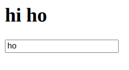

[What's Props ?](#whats-props)

[Event's in React Js ?](#events-in-react-js)

[What's State ?(useState)](#whats-state)

[State Lifting](#state-lifting)

[Rendering Multiple Components](#rendering-multiple-components)

[Styling React Components](#styling-react-components)

[UseEffect](#useeffect)

- [mount and unmount using useEffect](#mount-and-unmount-using-useeffect)

[useRef](#useref)

### What's Props ?

- Props is a way to `transforms data` to one component to another components

- props can be pass parent to child component
- we can't pass child to parent component

```jsx
const Tweet = (props) => {
  return (
    <div>
      <h1>hi i'm Tweet Component</h1>
      <h3>
        Where am i used ?<br /> {props.name}{' '}
      </h3>
    </div>
  );
};

const App = () => {
  let componentName = '=> app component';
  return (
    <div>
      <h1>App Component</h1>
      // here passing the componentName data to another component via props
      <Tweet name={componentName} />
    </div>
  );
};
```

### Event's in React Js ?

Normal javascript event

```js
button.addEventListener('onclick', (e) => {
  alert('Hi there ');
});
```

React Events

```js
const submitEvent = (e) => {
  alert('Hi there ');
};

const App = () => {
  return (
    <div>
      <h1>App Component</h1>
      <button onClick={submitEvent}>submit</button>
    </div>
  );
};

// or
<button onClick={(e) => alert('Hi there ')}>submit</button>;
```

reference [react events](https://flaviocopes.com/react-events/)

### What's State ?

when the state changes in component that component will rerender

```jsx
const App = () => {
  let name = 'hi Hemath';
  console.log(name);
  return (
    <div>
      <h1>hi {name}</h1>
      <input
        type="text"
        onChange={(e) => {
          name = e.target.value;
          console.log(name);
        }}
      />
    </div>
  );
};
```

input:


here variable values changes but the ui not updated it is in still initial values 'heamth'
so if you want update ui also need to add state variable

output in console:

```jsx

hi Hemath
h
ho
how
```

When you State variable changes ui also will update
state can be parent to child we can pass
we cant pass child to parent component

```jsx
const App = () => {
  const [name, setName] = useState('hemath');
  console.log(name);
  return (
    <div>
      <h1>hi {name}</h1>
      <input
        type="text"
        value={name}
        onChange={(e) => {
          setName(e.target.value);
          console.log(name);
        }}
      />
    </div>
  );
};
```

input:





output in console:

```
hemath
 h
 h
 h
 ho
 ho
 ho
 how
 how

```

### State Lifting

- from submit default browser will reload the page
- refresh or redirect some where while summing form

```jsx
const App = () => {
  const [name, setName] = useState('hemath');

  const submitHand = () => {
    alert(name);
  };
  return (
    <div>
      <form action="" onSubmit={submitHand}>
        <h1>hi {name}</h1>
        <input
          type="text"
          onChange={(e) => {
            setName(e.target.value);
          }}
        />
        <button type="submit">Submit</button>
      </form>
    </div>
  );
};
```

to avoid browser default behavior we can use ` e.preventDefault()` function

```jsx
const App = () => {
  const [name, setName] = useState('hemath');

  const submitHand = (e) => {
    e.preventDefault();
    alert(name);
  };
  return (
    <div>
      <form action="" onSubmit={submitHand}>
        <h1>hi {name}</h1>
        <input
          type="text"
          onChange={(e) => {
            setName(e.target.value);
          }}
        />
        <button type="submit">Submit</button>
      </form>
    </div>
  );
};
```

before lifting state

```jsx
const CreateTweet = () => {
  const [tweets, setTweets] = useState([]);
  // if you want pass tweets to ListTweet component you cant
  const [mes, setMes] = useState('');

  const submitHand = (e) => {
    e.preventDefault();
    setTweets([...setTweets, mes]);
    setMes('');
  };
  return (
    <form onSubmit={submitHand}>
      <h3>Create Tweet</h3>
      <input type="text" value={mes} onChange={(e) => setMes(e.target.value)} />
      <button type="submit">Submit</button>
    </form>
  );
};

const ListTweet = () => {
  return (
    <div>
      <h3>List of tweets</h3>
    </div>
  );
};

const App = () => {
  return (
    <div>
      <CreateTweet />
      <ListTweet />
    </div>
  );
};
```

- parent component two children components if take example p is parent a1 is one child a2 another child if you want pass data form a1 to a2 component you cant so move the a1 state to p component the made changes on a1 then in p we can pass that value to a2

state lifting

```jsx
const CreateTweet = ({ mes, setMes, setTweets, tweets }) => {
  const submitHand = (e) => {
    e.preventDefault();
    setTweets([...tweets, mes]);
    setMes('');
  };
  return (
    <form onSubmit={submitHand}>
      <h3>Create Tweet</h3>
      <input type="text" value={mes} onChange={(e) => setMes(e.target.value)} />
      <button type="submit">Submit</button>
    </form>
  );
};

const ListTweet = ({ tweets }) => {
  return (
    <div>
      <h3>List of tweets</h3>
      {tweets.map((a) => (
        <h5 key={a}>{a}</h5>
      ))}
    </div>
  );
};

const App = () => {
  const [tweets, setTweets] = useState([]);
  const [mes, setMes] = useState('');

  return (
    <div>
      <CreateTweet
        mes={mes}
        setMes={setMes}
        setTweets={setTweets}
        tweets={tweets}
      />
      <ListTweet tweets={tweets} />
    </div>
  );
};
```

### Rendering Multiple Components ?

```jsx
const Tweet = ({ tweet, setTweets }) => {
  return (
    <div>
      <hr />
      <h3>{tweet}</h3>
      <button onClick={(e) => setTweets((t) => t.filter((a) => a !== tweet))}>
        delete
      </button>
    </div>
  );
};

const CreateTweet = ({ mes, setMes, setTweets, tweets }) => {
  const submitHand = (e) => {
    e.preventDefault();
    setTweets([...tweets, mes]);
    setMes('');
  };
  return (
    <form onSubmit={submitHand}>
      <h3>Create Tweet</h3>
      <input type="text" value={mes} onChange={(e) => setMes(e.target.value)} />
      <button type="submit">Submit</button>
    </form>
  );
};

const ListTweet = ({ tweets, setTweets }) => {
  return (
    <div>
      <h3>List of tweets</h3>
      {tweets.map((a) => (
        <Tweet tweet={a} setTweets={setTweets} />
      ))}
    </div>
  );
};

const App = () => {
  const [tweets, setTweets] = useState([]);
  const [mes, setMes] = useState('');

  return (
    <div>
      <CreateTweet
        mes={mes}
        setMes={setMes}
        setTweets={setTweets}
        tweets={tweets}
      />
      <ListTweet tweets={tweets} setTweets={setTweets} />
    </div>
  );
};
```

### Styling React Components ?

1. inline styling

- use camelCase

```jsx
<div style={{ border: '1px solid blue', color: 'red' }}>how</div>;

const sty = { border: '1px solid blue', color: 'red' };
<div style={sty}>how</div>;
```

2. added class or id or tag
   we can target using css file like we do normally

this applies for globally

3. App.module.css
   .title {
   font-size: 2rem;
   background: lightsteelblue;
   }

```jsx
import s from './App.module.css';

// it's create unique classname by ground
<div className={s.title}>

```

4.  Styled component
auto complete extensions
<!-- vscode-styled-components -->

5.  using Sass

- npm i sass

### UseEffect

useEffect used when u need some functionality when the component first renders
,also when sate changes do some additional functionality to using useEffect

```jsx
useEffect(() => {
  console.log('how');
}, []);
```

when you leave array params as empty then component mount(first render component)that time only useEffect run

```jsx
const [tweets, setTweets] = useState([]);
const [mes, setMes] = useState('');

useEffect(() => {
  console.log('how');
}, [tweets]);
```

when u add some state values to array params when the state values changes that time only the use effect will run (not run when component first time render)

we can add n number of state values to the array params

like this way we have control of useEffect

### mount and unmount using useEffect ?

- Rendering component is called mount
- When you not release or delete that component called unmount
  when the component delete that time will work return function in useEffect

```jsx
useEffect(() => {
  console.log('mount');
  return () => {
    console.log('unmount');
  };
}, []);
```

```jsx
useEffect(() => console.log('mount'), []);
useEffect(() => console.log('data1 update'), [data1]);
useEffect(() => console.log('any update'));
useEffect(() => () => console.log('data1 update or unmount'), [data1]);
useEffect(() => () => console.log('unmount'), []);
```

### useRef()
- The useRef Hook allows you to persist values between renders.
- It can be used to store a mutable value that does not cause a re-render when updated.
- It can be used to access a DOM element directly.
- return only one current Property

Does Not Cause Re-renders
If we tried to count how many times our application renders using the useState Hook, we would be caught in an infinite loop since this Hook itself causes a re-render.

To avoid this, we can use the useRef Hook.
```jsx
function App() {
  const [inputValue, setInputValue] = useState("");
  const count = useRef(0);

  useEffect(() => {
    count.current = count.current + 1;
  });

  return (
    <>
      <input
        type="text"
        value={inputValue}
        onChange={(e) => setInputValue(e.target.value)}
      />
      <h1>Render Count: {count.current}</h1>
    </>
  );
}
```

Accessing DOM Elements
example : if you want to focus input box after rendering the component we can use useRef

```jsx

function App() {
  const inputElement = useRef();

  const focusInput = () => {
    inputElement.current.focus();
  };

  return (
    <>
      <input type="text" ref={inputElement} />
      <button onClick={ }>Focus Input</button>
    </>
  );
}

```

Working with Audi files

```jsx
function App() {
  const audioRef = useRef(null);

  const playSongHandler = () => {
    if (isPlaying) {
      audioRef.current.pause();
      setIsPlaying((currentVal) => !currentVal);
    } else {
      audioRef.current.play();
      setIsPlaying((currentVal) => !currentVal);
    }
  };

  return (
    <>
      <FontAwesomeIcon
        onClick={playSongHandler}
        className="play"
        size="2x"
        icon={faPlay}
      />
      <audio ref={audioRef} src={currentSong.audio}></audio>
    </>
  );
}
```
